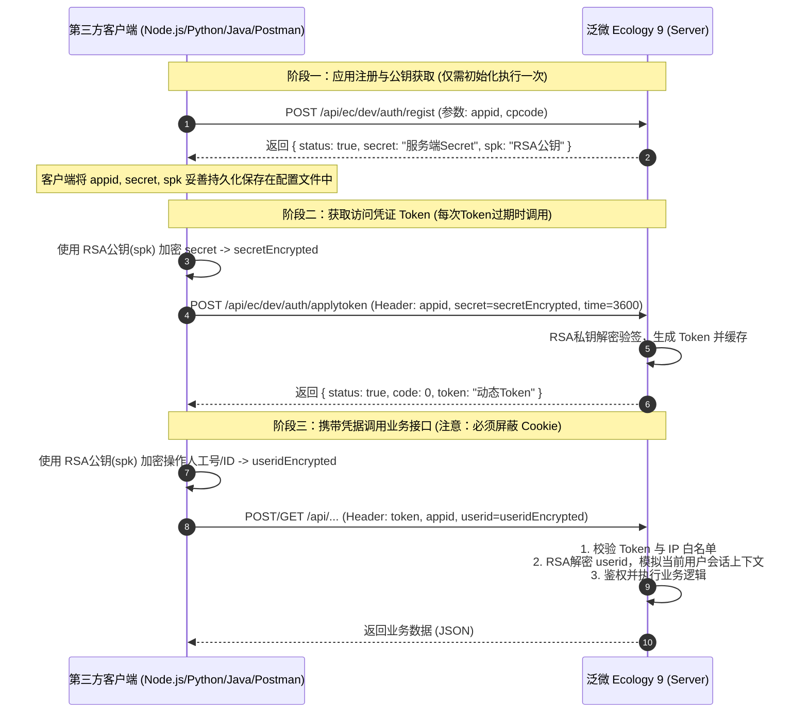

# 泛微OA (E-Cology 9) 开放平台安全认证与接口调用全功能指南

本文档全面整合泛微云商店官方权威认证规范、Token 握手生命周期、RSA/AES 密钥交换算法、接口白名单、跨域配置、单点登录 (SSO) 以及全部官方排错避坑方案。

---

## 1. 认证机制全景架构

泛微 Ecology 9（简称 E9）开放平台采用 **RSA 非对称加密 + AES 对称加密 + Token 动态会话令牌 + 用户身份密文校验** 的多重安全认证机制。



---

## 2. 详细接口规范与参数说明

### 2.1 第一步：注册应用获取公钥密钥 (`/api/ec/dev/auth/regist`)

用于在 OA 系统中初始化该第三方应用的接入凭证，获取服务端 RSA 公钥（`spk`）和密钥（`secret`）。

> [!CAUTION]
> **重要原则**：该接口**只需要请求一次**！
> 每次调用该接口都会重新生成并覆盖服务端的公私钥对。如果在生产环境中重复调用，将导致先前已发出的旧密钥全部失效，出现 `解密失败！` 报错。因此获取成功后必须将 `appid`, `secret`, `spk` 妥善保存在客户端配置文件或数据库中！

- **接口地址**: `http://oa-server/api/ec/dev/auth/regist`
- **请求方式**: `POST`
- **Content-Type**: `application/x-www-form-urlencoded; charset=utf-8`

#### 请求参数
| 参数名 | 必选 | 类型 | 说明 |
| :--- | :---: | :--- | :--- |
| `appid` | **是** | String | 许可证号码 / 应用唯一标识（如 `b59e05ced89f43d69ed7d6bdb6c57140`） |
| `cpcode` | 否 | String | 公司编码（缺省填空字符串 `""`） |

#### 响应示例
```json
{
  "status": true,
  "code": 0,
  "msg": "ok",
  "secret": "9d8e7f6a5b4c3d2e1f0a",
  "spk": "MIGfMA0GCSqGSIb3DQEBAQUAA4GNADCBiQKBgQC3rK...IDAQAB"
}
```

---

### 2.2 第二步：获取访问 Token (`/api/ec/dev/auth/applytoken`)

使用第一步保存在本地的 RSA 公钥（`spk`）对第一步获取的密钥（`secret`）进行 RSA 加密后提交，获取本次会话的动态 Token。

- **接口地址**: `http://oa-server/api/ec/dev/auth/applytoken`
- **请求方式**: `POST`
- **Content-Type**: `application/x-www-form-urlencoded; charset=utf-8`

#### 请求头部与表单参数 (Headers / Body)
| 参数名 | 必选 | 传递位置 | 说明 |
| :--- | :---: | :--- | :--- |
| `appid` | **是** | Header / Body | 注册的应用唯一标识 AppID |
| `secret` | **是** | Header / Body | **使用 RSA 公钥 (`spk`) 加密第一步返回的 `secret` 得到的密文**（Base64 字符串） |
| `time` | 否 | Header / Body | Token 有效时长（秒），缺省通常为 `1800` 或 `3600` |

#### 加密算法标准
- **算法**: RSA
- **填充模式**: `RSA/ECB/PKCS1Padding`
- **字符编码**: UTF-8
- **输出格式**: Base64 编码

#### 响应示例
```json
{
  "status": true,
  "code": 0,
  "msg": "ok",
  "token": "4a5c88e2-9bf6-4b2a-886f-23910c28d7a1"
}
```

---

### 2.3 第三步：携带 Token 调用业务接口

在调用泛微 OA 任意后端 RESTful 接口（工作流、人力资源、知识管理等）时，必须在 HTTP Header 中传递以下标准鉴权头。

#### 请求头 (HTTP Headers)
| 请求头字段 | 必选 | 说明 | 示例值 |
| :--- | :---: | :--- | :--- |
| `token` | **是** | 第二步获取到的有效 Token | `4a5c88e2-9bf6-4b2a-886f-23910c28d7a1` |
| `appid` | **是** | 注册的应用 AppID | `b59e05ced89f43d69ed7d6bdb6c57140` |
| `userid` | **是** | **使用 RSA 公钥 (`spk`) 对操作人工号或用户ID加密生成的密文** | `h8d9f+Jkl...==` (加密后的 "1") |
| `skipsession` | 否 | 是否跳过 Session 拦截（白名单接口传 `1`，默认 `0`） | `0` |
| `Content-Type` | 条件 | POST 请求请统一设置为 `application/json; charset=utf-8` 或 `application/x-www-form-urlencoded; charset=utf-8` | `application/json; charset=utf-8` |

> [!IMPORTANT]
> **极其重要**：`userid` 必须传递！如果不传递 `userid`，接口将无法识别当前操作人上下文，导致无法获取待办、创建流程或访问有权限控制的资源。

---

## 3. 官方排错与避坑红线 (Crucial Pitfalls & Solutions)

### 3.1 避坑红线一：Cookie 干扰与用户“串号”问题
- **现象描述**：调用接口时，即使传递了不同的 `userid`，系统内部依然获取到上一次请求的用户，或者待办数据全部错乱。
- **根本原因**：第三方 HTTP 客户端（如 Axios、Hutool、Postman、Python requests）默认启用了 Cookie 管理器。泛微 OA 在接收到请求后如果发现携带了已有的 `JSESSIONID` Cookie，会优先复用该 Session，从而**忽略 Header 中传入的最新 `userid`**！
- **解决方案**：
  1. **所有第三方调用代码必须彻底禁用 Cookie 自动存储与传递**。
  2. 在 Postman 中测试时，必须在请求设置中清空或关闭 Cookie Jar。
  3. Node.js 中使用原生 `http`/`https` 或禁用 Axios `withCredentials`；Python 中每次构建独立的 `urllib.request.Request` 或清空 Session Cookie。

### 3.2 避坑红线二：重复调用 `regist` 导致密钥失效
- **现象描述**：接口原本调用正常，突然全部返回 `{"status":false,"code":-1,"msg":"解密失败！"}`。
- **根本原因**：其他开发者或脚本再次调用了 `/api/ec/dev/auth/regist`，导致 OA 服务端的公私钥被刷新，之前保存的密文无法被新私钥解密。
- **解决方案**：`regist` 只调用一次并将结果固化在配置文件中。在新版 KB 中，建议进入 OA 后台【集成中心】查看或重置密钥，避免通过接口并发重复注册。

### 3.3 避坑红线三：Jar 包冲突导致 500 异常
- **现象描述**：调用接口出现 HTTP 500 错误，查看 OA 后台 `stderr.log` 包含以下报错：
  ```
  Caused by: java.util.jar.JarException: file:/weaver/ecology/WEB-INF/lib/... has unsigned entries - org/bouncycastle/...
  ```
- **解决方案**：
  1. **北森 SDK 冲突**：若 `WEB-INF/lib/` 下存在 `Beisen.OIDC.SDK.1.8.jar`，建议屏蔽冲突类或联系北森提供无冲突编译包。
  2. **BouncyCastle 冲突**：将 `WEB-INF/lib/bcprov-*.jar` 统一更新为官方推荐的兼容版本并重启 Ecology 服务。

### 3.4 避坑红线四：集群环境下 Token 丢失或超时
- **现象描述**：Token 刚获取到，调用业务接口就返回 `token:不存在或者超时`。
- **解决方案**：Ecology 集群环境下 Token 默认存储在 Redis 中。请检查 Redis 连接池是否正常，各 OA 节点是否连接至同一 Redis 实例。若未配置 Redis，需在后台将 Token 存储模式调整为数据库存储。

### 3.5 避坑红线五：旧版本 KB 的 Session Invalidate Bug
- **涉及版本**：KB900210208 及更早版本。
- **现象**：Token 认证调用一直报 500，且伴随 HTML 错误页。
- **原因**：OA 底层 `DoUserSessionCmd` 中误执行了 `request.getSession(true).invalidate();` 导致 Session 刚创建即被销毁。
- **修复**：升级到最新 OA 补丁包，或在后端将该行注销。

---

## 4. 接口白名单配置与安全拦截

泛微 Ecology 内部由 **SecurityFilter（安全补丁包）** 和 **接口鉴权过滤器** 两层共同防护。

### 4.1 白名单配置文件路径
- 配置文件：`ecology/WEB-INF/security_rules.xml` 或系统集成白名单管理页面。
- 格式示例：
  ```xml
  <security>
      <!-- 配置不需要 Token 鉴权即可公开访问的自定义接口 -->
      <url-whitelist>
          <url>/api/custom/public/*</url>
          <url>/api/integration/callback</url>
      </url-whitelist>
  </security>
  ```
- **生效方式**：修改后需重启 Resin / Tomcat，或在后台【系统安全中心 -> 规则重载】刷新生效。

---

## 5. 跨域 (CORS) 解决方案

当由前端 Web 应用直接调用 OA 接口时，若遇到 CORS 跨域报错，官方标准解决方案：

1. **Nginx 反向代理层配置（推荐）**:
   ```nginx
   location /api/ {
       proxy_pass http://ecology_cluster;
       add_header 'Access-Control-Allow-Origin' '$http_origin' always;
       add_header 'Access-Control-Allow-Credentials' 'true' always;
       add_header 'Access-Control-Allow-Methods' 'GET, POST, PUT, DELETE, OPTIONS' always;
       add_header 'Access-Control-Allow-Headers' 'DNT,X-CustomHeader,Keep-Alive,User-Agent,X-Requested-With,If-Modified-Since,Cache-Control,Content-Type,token,appid,userid,skipsession' always;
       if ($request_method = 'OPTIONS') {
           return 204;
       }
   }
   ```
2. **后端服务转发**：第三方系统通过后端 Server-to-Server 转发，避免前端直接暴露 AppID 与 Token 密钥。
