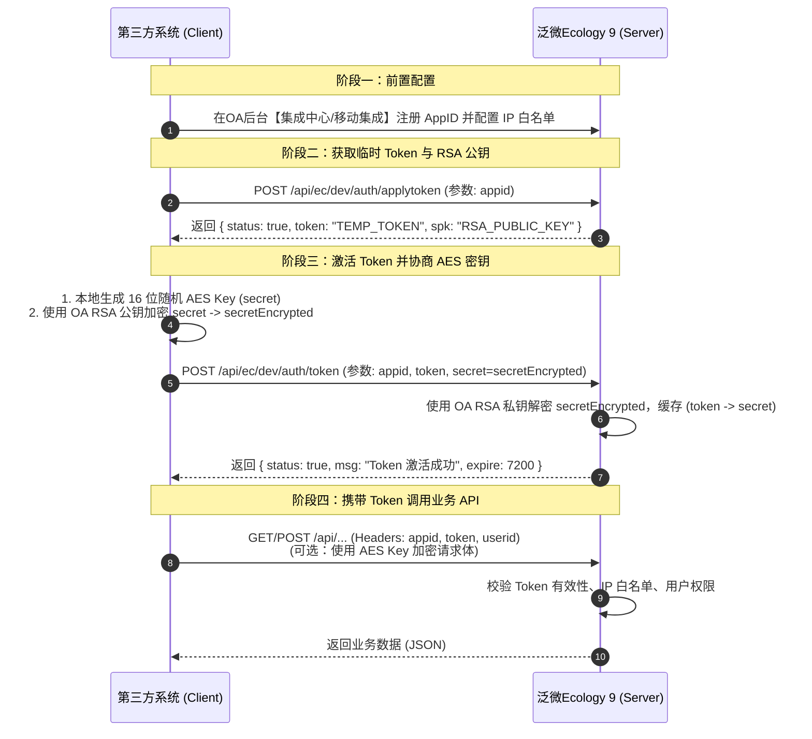

# 泛微OA (E-Cology 9) 开放平台安全认证与接口调用规范

泛微 Ecology 9（简称 E9）开放平台采用 **RSA 非对称加密 + AES 对称加密 + Token 动态会话令牌** 的多重安全认证机制，保障第三方系统与 OA 系统间通信的机密性、完整性与身份合法性。

---

## 1. 认证流程全景图

E9 官方标准认证流程分为 **应用注册**、**申请临时令牌与公钥**、**交换对称密钥激活令牌**、**业务接口调用** 四个阶段：



---

## 2. 详细步骤与接口说明

### 2.1 步骤一：申请临时 Token 与服务端 RSA 公钥 (`applytoken`)

- **接口地址**: `/api/ec/dev/auth/applytoken`
- **请求方式**: `POST` / `GET`
- **Content-Type**: `application/x-www-form-urlencoded`

#### 请求参数
| 参数名 | 类型 | 必填 | 说明 |
| :--- | :--- | :---: | :--- |
| `appid` | String | **是** | 在泛微 OA 后台注册的应用唯一标识（如 `ERP_INTEGRATION_01`） |

#### 响应示例
```json
{
  "code": "1",
  "status": true,
  "token": "4a5c88e2-9bf6-4b2a-886f-23910c28d7a1",
  "spk": "MIGfMA0GCSqGSIb3DQEBAQUAA4GNADCBiQKBgQC3r..."
}
```

> [!NOTE]
> - `token` 为临时令牌，生命周期通常为 60 秒，必须在过期前完成步骤二的激活。
> - `spk` 为泛微服务端动态生成的 RSA 公钥（Base64 编码，X.509 格式）。

---

### 2.2 步骤二：绑定密钥并激活 Token (`token`)

客户端在本地生成 16 字节随机字符串作为对称加密密钥 `secret`（AES Key），使用服务端返回的 RSA 公钥 `spk` 加密该 `secret`，并提交给 OA 服务端完成绑定。

- **接口地址**: `/api/ec/dev/auth/token`
- **请求方式**: `POST`
- **Content-Type**: `application/x-www-form-urlencoded`

#### 请求参数
| 参数名 | 类型 | 必填 | 说明 |
| :--- | :--- | :---: | :--- |
| `appid` | String | **是** | 应用标识 AppID |
| `token` | String | **是** | 步骤一获取到的临时 Token |
| `secret` | String | **是** | 使用 RSA 公钥加密后的 AES 密钥密文（Base64 字符串） |

#### 加密算法说明
- **RSA 填充模式**: `RSA/ECB/PKCS1Padding`
- **密钥生成**: 16 字符随机字符串（如 `abcdef0123456789`）

#### 响应示例
```json
{
  "code": "1",
  "status": true,
  "msg": "success",
  "token": "4a5c88e2-9bf6-4b2a-886f-23910c28d7a1"
}
```

---

### 2.3 步骤三：调用业务 API 请求头标准规范

完成激活后，在调用泛微 OA 任意后端业务接口时，必须在 **HTTP Header** 中携带以下标准字段：

| 请求头字段 (Header) | 必填 | 说明 | 示例值 |
| :--- | :---: | :--- | :--- |
| `appid` | **是** | 注册的应用唯一标识 | `ERP_INTEGRATION_01` |
| `token` | **是** | 激活后的有效令牌 | `4a5c88e2-9bf6-4b2a-886f-23910c28d7a1` |
| `userid` | 条件必填 | 执行操作的 OA 用户 ID (HrmResource)。创建流程/发文档时必填 | `1` 或加密字符串 |
| `Content-Type` | **是** | 请求格式，一般为 JSON 或 Form 表单 | `application/json;charset=UTF-8` |
| `spml-token` | 否 | 移动端专用会话 Token | - |

> [!TIP]
> 如果 Ecology 系统开启了【用户参数加密】，`userid` 需要使用协商好的 `secret` 通过 AES 算法进行加密。如果未开启强加密模式，可直接传递明文用户 ID（如 `1` 代表系统管理员）。

---

## 3. AES 加解密规范（敏感数据传输）

当调用接口需要对请求体或响应体进行对称加密传输时，采用如下标准：

| 算法特性 | 规范值 |
| :--- | :--- |
| **算法** | AES (Advanced Encryption Standard) |
| **加密模式** | `CBC` 或 `ECB`（以 Ecology 后台配置为准，默认常用 `ECB`） |
| **填充模式** | `PKCS5Padding` |
| **密钥长度** | 128 bit（16 字节 ASCII 字符串） |
| **编码方式** | 加密输出 Base64 编码字符串 / UTF-8 字符集 |

---

## 4. 泛微 OA 后台前置配置指引

在进行接口对接前，必须在泛微 OA 后台完成以下配置：

1. **注册外部应用**:
   - 路径：`后端管理 -> 集成中心 -> WebService / REST 开放平台 -> 客户端应用注册`
   - 新建应用，填写 **应用名称**（如“ERP集成”）、**AppID**（自定义英文与下划线）。
2. **设置 IP 白名单**:
   - 在应用详情中配置允许调用该 AppID 的第三方服务器 IPv4 地址（支持多 IP 逗号分隔）。
3. **接口权限授权**:
   - 为该 AppID 分配允许访问的 API 资源范围（工作流、人力资源、知识管理等）。
4. **安全过滤器与跨域 (CORS)**:
   - 若由前端浏览器跨域调用，需在 Ecology `web.xml` 或 Nginx 反向代理层配置 CORS 头（建议通过第三方后端服务代理调用，避免泄露 AppID 与 Token）。

---

## 5. 常见响应状态码与异常处理

泛微 E9 接口通常在 HTTP 200 下返回标准 JSON 响应体结构：

```json
{
  "api_status": true,
  "status": "1",
  "msg": "操作成功",
  "data": {}
}
```

### 常见状态判定
- `api_status == true` 或 `status == "1"`: 接口调用成功。
- `status == "0"` 或 `api_status == false`: 业务逻辑错误或系统异常，具体原因见 `msg` / `message` / `errMsg` 字段。
- `code == "-1"` 或 `status == 401`: Token 无效或已过期，客户端拦截器应自动触发 **重新申请与激活 Token** 并自动重试请求。
- `IP not allowed`: 调用方服务器 IP 未添加到后台白名单中。
- `AppId not exist`: AppID 未在 OA 后台注册或拼写错误。
